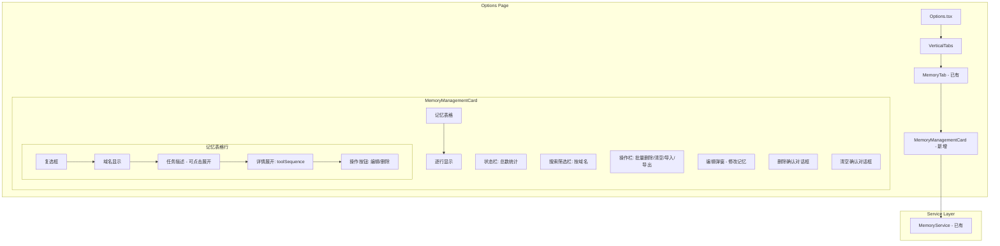
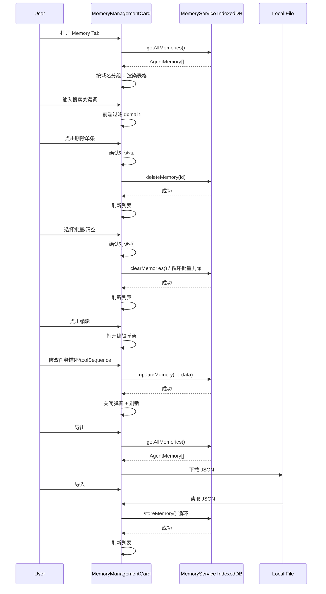

# 记忆管理 UI 功能规划

## 1. 当前状态分析

### 现有基础设施（完善）
| 组件 | 功能 | 位置 |
|------|------|------|
| `MemoryService` | IndexedDB 单例，CRUD 操作完整 | `src/tracking/memoryService.ts` |
| `AgentMemory` 接口 | `domain`, `taskDescription`, `toolSequence`, `createdAt`, `id` | 同上 |
| `domainUtils` | 域名规范化 | `src/tracking/domainUtils.ts` |
| `memoryTools` | Agent 端记忆工具（5个函数） | `src/agent/tools/memoryTools.ts` |
| `MemoryManager` | Agent 启动时自动查找相关记忆 | `src/agent/MemoryManager.ts` |
| `reflectionController` | 执行后自动生成学习记忆 | `src/background/reflectionController.ts` |
| `defaultMemories.json` | 预置常用网站记忆模板 | `src/tracking/defaultMemories.json` |

### 现有 UI（不足）
| 组件 | 能力 | 不足 |
|------|------|------|
| `MemoryManagement.tsx` | 仅显示记忆总数 + 导入/导出按钮 | ❌ 无法查看列表 ❌ 无法删除 ❌ 无法搜索 ❌ 无法编辑 |
| `MemoryTab.tsx` | 简单包裹 MemoryManagement | 同上 |

## 2. 目标功能

### 核心功能
```
1. 记忆列表视图 - 按域名分组，支持排序
2. 单条记忆查看 - 展开查看 toolSequence 详情
3. 搜索/筛选 - 按域名关键词快速筛选
4. 单条删除 - 确认后删除指定记忆
5. 批量删除 - 支持全选/按域名批量删除
6. 清空所有记忆 - 二次确认后的清除操作
7. 编辑记忆 - 修改 taskDescription 和 toolSequence
```

### 增强功能
```
8. 记忆状态标签 - 显示来源（预置/用户创建/自动反射）
9. 云端同步（预备接口）- 为后续远程同步预留扩展点
```

## 3. 架构设计

### 组件树


### 数据流


## 4. 文件变更清单

### 新增文件
| 文件 | 用途 |
|------|------|
| `src/options/components/MemoryManagementCard.tsx` | 核心记忆管理组件（替代现有 MemoryManagement.tsx） |
| `src/options/components/MemoryTableRow.tsx` | 单行记忆显示组件（含展开详情） |
| `src/options/components/MemoryEditModal.tsx` | 编辑记忆弹窗 |
| `src/options/components/MemoryDeleteConfirm.tsx` | 删除确认对话框（可复用） |

### 修改文件
| 文件 | 变更内容 |
|------|----------|
| `src/options/components/MemoryManagement.tsx` | **完全重写** —— 从简单的导入/导出升级为完整管理界面 |
| `src/options/components/tabs/MemoryTab.tsx` | 更新导入路径（如果组件名变化）|
| `src/tracking/memoryService.ts` | 新增 `getDomains()` 方法 + `countMemories()` 方法 |

### 无需修改
| 文件 | 理由 |
|------|------|
| `src/tracking/domainUtils.ts` | 已有规范化功能，直接使用 |
| `src/agent/tools/memoryTools.ts` | Agent 端工具不变 |
| `src/agent/MemoryManager.ts` | Agent 端自动查找逻辑不变 |
| `src/background/reflectionController.ts` | 自动反射逻辑不变 |
| `public/manifest.json` | 无需新增权限 |
| `src/options/Options.tsx` | 无状态变更，组件自包含 |
| `src/options/components/VerticalTabs.tsx` | 已渲染 MemoryTab，无变化 |

## 5. 详细实现方案

### 5.1 MemoryService 扩展

在 `src/tracking/memoryService.ts` 新增两个方法：

**`getDomains(): Promise<string[]>`**
- 遍历 IndexedDB 的 domain 索引
- 返回所有不重复的域名列表
- 用于前端按域名分组展示

**`countMemories(): Promise<number>`**
- 复用现有 `getAllMemories()` 逻辑
- 返回 `length` 即可
- 替代当前 `MemoryManagement.tsx` 中手动获取全量再计数的做法

### 5.2 MemoryManagementCard 组件

**状态管理：**
- `allMemories: AgentMemory[]` — 全量记忆数据
- `filteredMemories: AgentMemory[]` — 筛选后的记忆数据
- `searchQuery: string` — 搜索关键词
- `selectedIds: Set<number>` — 已选中的记忆 ID 集合
- `expandedIds: Set<number>` — 已展开查看详情的记忆 ID 集合
- `editingMemory: AgentMemory | null` — 正在编辑的记忆
- `deleteTarget: number | null` — 待删除的记忆 ID
- `showClearConfirm: boolean` — 是否显示清空确认
- `loading: boolean` — 加载状态

**视图布局：**
```
┌─────────────────────────────────────────────┐
│  🧠 Memory Management                       │
│  Total: 42 memories from 8 domains          │
├─────────────────────────────────────────────┤
│  🔍 [搜索域名...]        [预置] [用户] 全部  │
├─────────────────────────────────────────────┤
│  ☐ All  [批量删除] [清空全部] [导出] [导入]  │
├───────┬───────────┬─────────────┬───────────┤
│  Domain │ Task     │ Steps Count │ Created   │
├───────┼───────────┼─────────────┼───────────┤
│  ☐ google  │ 搜索    │ 4 steps     │ 2026-06-22│
│           │ ▼ Search...│           │           │
│           │   1. click textarea        │           │
│           │   2. type [search term]    │           │
│           │   3. press Enter           │           │
│           │   4. wait for navigation   │           │
│           │   [✏️ Edit] [🗑️ Delete]   │           │
├───────┼───────────┼─────────────┼───────────┤
│  ☐ linkedin│ 查通知   │ 3 steps     │ 2026-06-20│
│  ...                                       │
└───────┴───────────┴─────────────┴───────────┘
```

### 5.3 搜索与筛选逻辑

```typescript
// 搜索过滤
const filteredMemories = useMemo(() => {
  if (!searchQuery.trim()) return allMemories;
  
  const query = searchQuery.toLowerCase().trim();
  return allMemories.filter(memory =>
    memory.domain.toLowerCase().includes(query) ||
    memory.taskDescription.toLowerCase().includes(query)
  );
}, [allMemories, searchQuery]);
```

### 5.4 编辑弹窗

```
┌──────────────────────────────────────┐
│  ✏️ Edit Memory                      │
│  ─────────────────────────────────── │
│  Domain: google.com                  │
│                                      │
│  Task Description:                   │
│  [ Perform a search on Google    ]   │
│                                      │
│  Tool Sequence (one per line):       │
│  [ browser_click | textarea[...]  ]  │
│  [ browser_keyboard_type | [...]  ]  │
│  [ browser_press_key | Enter      ]  │
│  [ browser_wait_for_navigation |  ]  │
│                                      │
│           [Cancel] [💾 Save]         │
└──────────────────────────────────────┘
```

### 5.5 云端同步预留接口

```typescript
// 为未来云端同步预留的接口类型
export interface MemorySyncProvider {
  syncUpload(memories: AgentMemory[]): Promise<{ success: boolean; error?: string }>;
  syncDownload(): Promise<{ memories: AgentMemory[]; success: boolean; error?: string }>;
}

// MemoryService 中预留的方法
public async syncToCloud(provider: MemorySyncProvider): Promise<void> {
  // 预留 - 等待 v0.3.0 实现
  throw new Error('Cloud sync not yet implemented');
}

public async syncFromCloud(provider: MemorySyncProvider): Promise<void> {
  // 预留 - 等待 v0.3.0 实现
  throw new Error('Cloud sync not yet implemented');
}
```

## 6. 实现步骤

### Step 1: MemoryService 扩展
- 在 `src/tracking/memoryService.ts` 中添加 `getDomains()` 和 `countMemories()` 方法
- 添加云端同步预留接口类型

### Step 2: 创建 MemoryDeleteConfirm 组件
- 可复用的确认对话框
- 支持单条删除和批量删除确认
- 显示即将删除的记忆摘要

### Step 3: 创建 MemoryEditModal 组件
- 模态弹窗，编辑 taskDescription 和 toolSequence
- toolSequence 以多行文本框形式展示，每行一个步骤
- 保存时调用 MemoryService.updateMemory()

### Step 4: 重写 MemoryManagement 组件
- 完全重写为 MemoryManagementCard
- 包含: 统计栏、搜索栏、操作栏、记忆表格
- 表格行支持展开/折叠 toolSequence
- 每行支持编辑和删除操作
- 支持多选和批量删除
- 支持清空所有记忆
- 保留导入/导出功能

### Step 5: 更新 MemoryTab
- 将 MemoryManagement 引用更新为新组件

### Step 6: 边界情况处理
- 空状态: 显示友好的空列表提示，引导用户
- 加载中: 显示加载骨架屏
- 错误处理: 对 IndexedDB 操作异常显示错误提示
- 大量记忆: 考虑虚拟列表或分页（可选）

## 7. 设计原则

1. **渐进增强** — 在现有 MemoryService 基础上扩展，不破坏现有 Agent 工具
2. **自包含** — 新组件内部管理状态，不修改 Options.tsx 的全局状态
3. **可访问性** — 所有交互按钮有 aria-label，对话框可键盘关闭 (Escape)
4. **一次性确认** — 删除操作必须有确认对话框，避免误操作
5. **即时反馈** — 操作后立即更新 UI 状态，不需要手动刷新页面
6. **响应式** — 适配 Options 页面的布局尺寸

## 8. UI 样式约定

使用 DaisyUI 组件（项目已有依赖）：
- 表格: `<table className="table table-zebra">`
- 按钮: `<button className="btn btn-{primary/secondary/error/ghost} btn-sm">`
- 弹窗: `<dialog className="modal modal-open">`
- 搜索框: `<input className="input input-bordered input-sm">`
- 标签: `<span className="badge badge-{primary/secondary}">`
- 提示: `<div className="alert alert-{info/success/warning/error}">`
- 骨架屏: `<div className="skeleton">`
